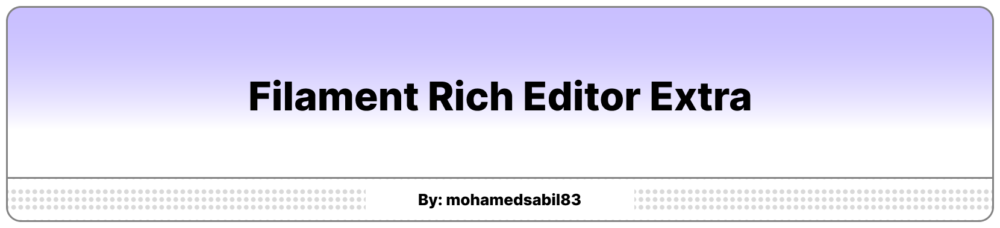

# A set of extra extensions for Filament RichEditor



[](https://packagist.org/packages/mohamedsabil83/filament-rich-editor-extra)
[](https://github.com/mohamedsabil83/filament-rich-editor-extra/actions?query=workflow%3Arun-tests+branch%3Amain)
[](https://github.com/mohamedsabil83/filament-rich-editor-extra/actions?query=workflow%3A"Fix+PHP+code+style+issues"+branch%3Amain)
[](https://packagist.org/packages/mohamedsabil83/filament-rich-editor-extra)

Extra goodies for the Filament Forms RichEditor (v4). This package ships small, focused extensions that plug straight into your existing editor — no configuration required.

### Currently included:
- **Text Direction** — `ltr` / `rtl` toolbar buttons that set the direction of the current block.
- **Emoji** — a toolbar button that opens a full emoji picker (search, categories, skin tones, the complete Unicode set) and inserts the chosen emoji as plain text.
- **Fullscreen** — a toolbar button that expands the editor to fill the viewport (toggle again or press `Esc` to exit).
- More to come...

## Requirements

| Package Version | PHP Version | Laravel Version | Filament Forms Version |
|:---------------:|:-----------:|:---------------:|:----------------------:|
|       1.x       |    8.2+     |       11+       |          4.x           |

## Installation

You can install the package via composer:

```bash
composer require mohamedsabil83/filament-rich-editor-extra
```

Then run the package installer:

```bash
php artisan filament-rich-editor-extra:install
```

## Usage

Once installed, the extensions are registered automatically on **every** RichEditor instance — no additional setup is required. You only need to opt the toolbar buttons you want into a specific editor via `->toolbarButtons()`.

Each extension adds one or more buttons that you reference by name:

| Extension      | Button name(s)   |
|----------------|------------------|
| Text Direction | `ltr`, `rtl`     |
| Emoji          | `emoji`          |
| Fullscreen     | `fullscreen`     |

```php
use Filament\Forms\Components\RichEditor;

RichEditor::make('content')
    ->label('Content')
    ->toolbarButtons([
        ['bold', 'italic', 'link'],
        ['ltr', 'rtl'],
        ['emoji'],
        ['fullscreen'],
    ]);
```

> [!TIP]
> Pass a nested array of button names to group them into separate toolbar sections, or a flat array (e.g. `['emoji', 'ltr', 'rtl']`) to keep them together.

### Text Direction

Adds **LTR** and **RTL** buttons that set the text direction of the current block (paragraph or heading). The direction is stored as a `dir` attribute and rendered identically on the server, so it round-trips through saving and display.

```php
RichEditor::make('content')
    ->toolbarButtons(['ltr', 'rtl']);
```

### Emoji

Adds an **emoji** button that opens a full-featured picker (search, categories, skin-tone selection, and the complete Unicode emoji set). Selecting an emoji inserts it as a plain Unicode character, so the content stays portable — no custom node or extra markup is saved.

```php
RichEditor::make('content')
    ->toolbarButtons(['emoji']);
```

The picker is stacked to the toolbar button and is fully responsive: on desktop it opens beneath the button (flipping above it when there isn't enough room), and on small/mobile screens it appears as a bottom sheet.

> [!NOTE]
> The emoji data (~1&nbsp;MB) is fetched once from a public CDN and then cached in the browser's IndexedDB, so the picker needs network access the first time it is opened.

### Fullscreen

Adds a **fullscreen** button that expands the editor (toolbar and content) to fill the viewport so you can write without distractions. Click the button again, or press `Esc`, to return to the inline layout. It is a client-side toggle only — nothing extra is saved with the content.

```php
RichEditor::make('content')
    ->toolbarButtons(['fullscreen']);
```

## Testing

```bash
composer test
```

## Changelog

Please see [CHANGELOG](CHANGELOG.md) for more information on what has changed recently.

## Contributing

Please see [CONTRIBUTING](CONTRIBUTING.md) for details.

## Security Vulnerabilities

Please review [our security policy](../../security/policy) on how to report security vulnerabilities.

## Credits

- [MohamedSabil83](https://github.com/mohamedsabil83)
- [All Contributors](../../contributors)

## License

The MIT License (MIT). Please see [License File](LICENSE.md) for more information.
